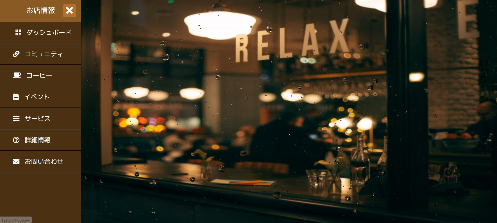
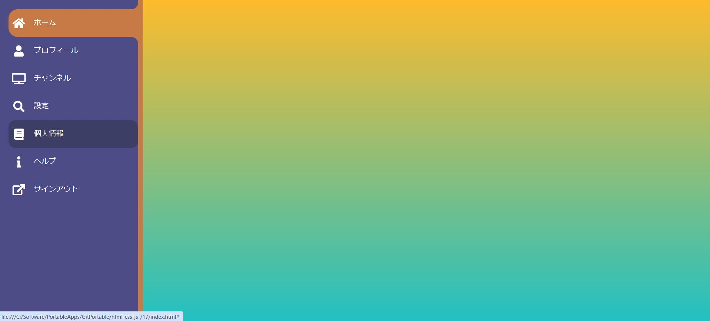
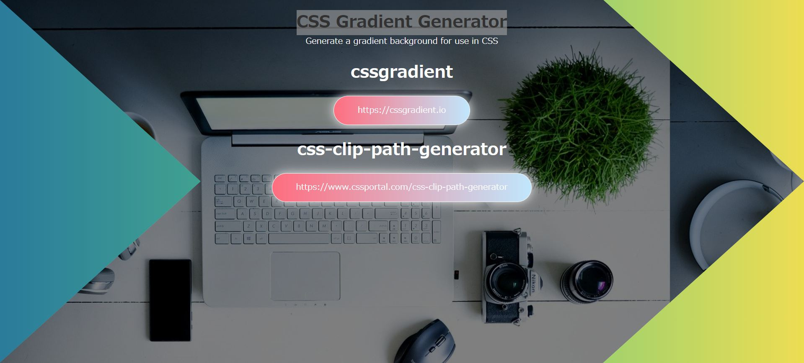
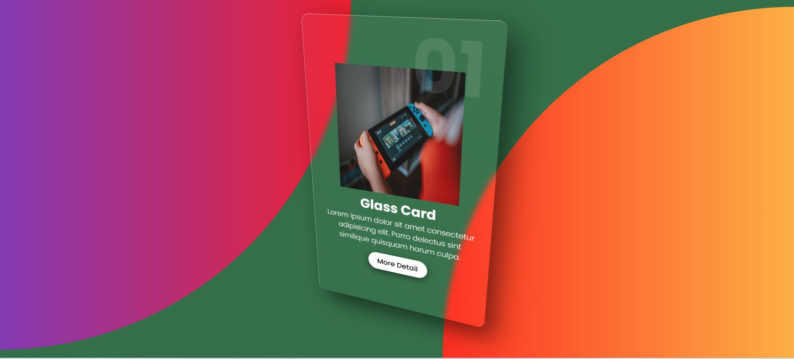
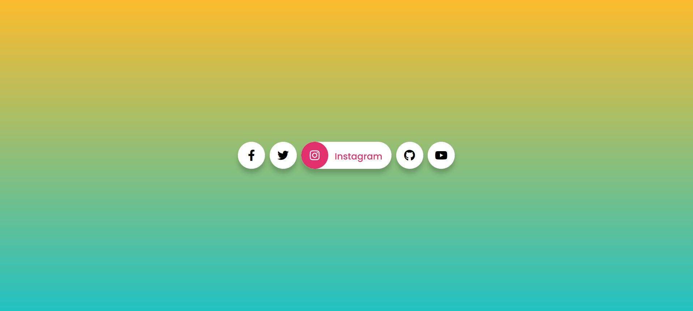
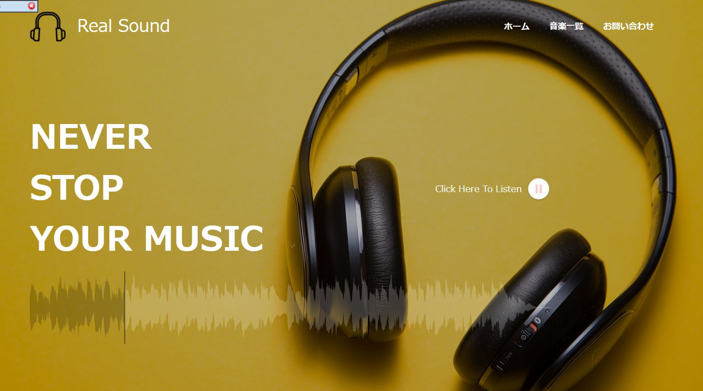
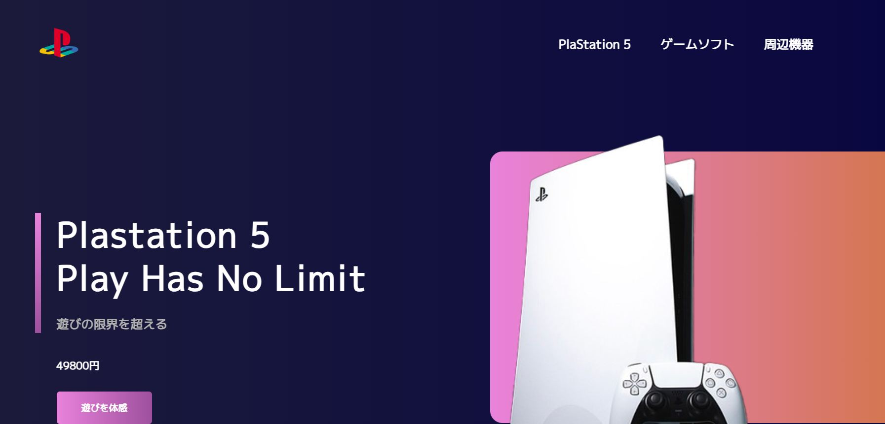
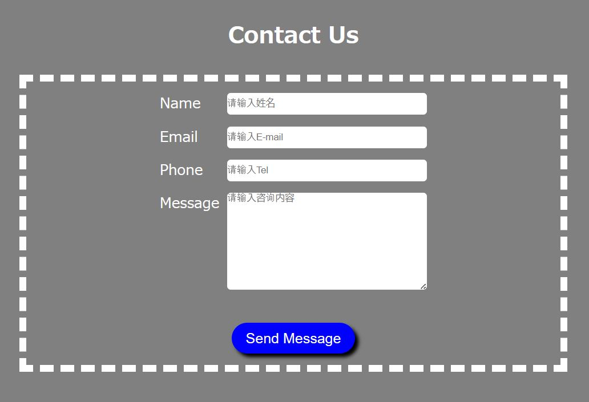
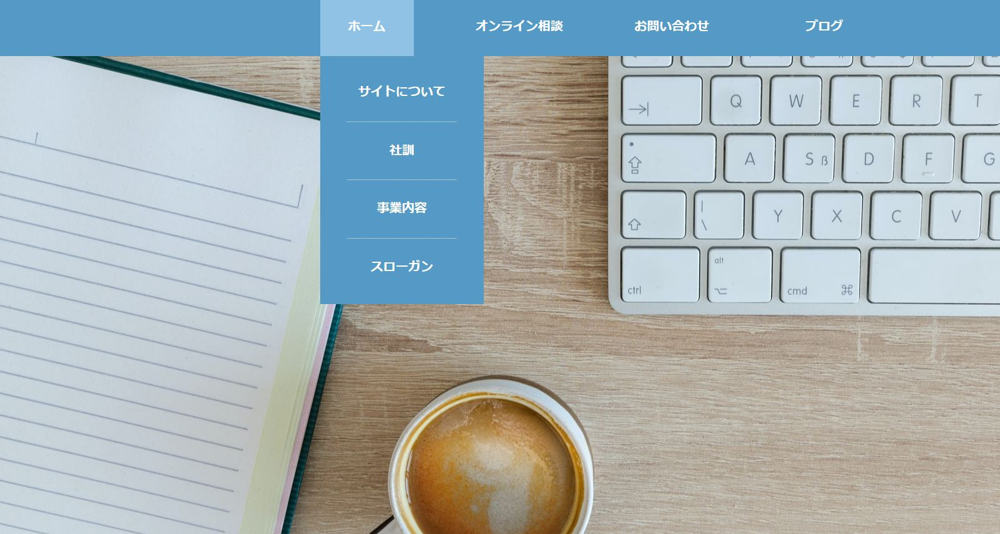

## 01 圣杯布局（顶部固定）

## 01_2 固定顶部

## 02 企业主页（js鼠标跟随）

## 03 视频背景

## 04 产品主页（js旋转）

## 05 3D主页（Three.js）

## 06 dark-mode（classList.toggle()）

## 07 Hamburger-menu（classList.toggle()）

## 07-2 sider menu (rainday.js、font-awesome5)

## 07-3 sider menu (font-awesome5)

## 08 下雪效果（自作js）

## 09 企业主页（bootstrap5）

## 10 CSS Gradient Generator

## 11 Glass Card (vanilla-tilt.js)

## 12 Scroll Reveal Tutorial (scrollreveal.js)

## 13 SNS媒体（font-awesome5）

## 14 Music（WaveSurfer.js）

## 15 企业主页 (scrollreveal.js)

## 16 炫酷背景

## 17 HTMLのみForm（https://www.staticforms.xyz）

## 18 nodejs chat-app（socket.io, SQlite）

